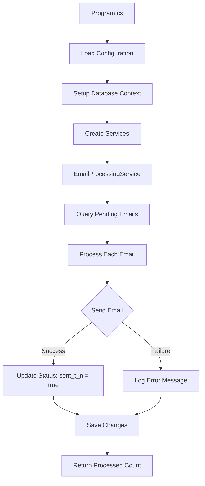

# Architecture Documentation

## Overview

The Automatic Email Sender follows a clean architecture pattern with separation of concerns, dependency injection, and comprehensive testing support.

## 🏗️ Project Structure

```
AutomaticMailer/
├── Models/                         # Data models and entities
│   ├── EmailSend.cs               # Main email queue entity
│   ├── EmailSettings.cs           # Email configuration model
│   ├── NotificationRecord.cs      # Legacy notification entity
│   └── NotificationSettings.cs    # Legacy notification settings
├── Data/                          # Data access layer
│   └── NotificationDbContext.cs   # Entity Framework DbContext
├── Services/                      # Business logic layer
│   ├── EmailProcessingService.cs  # Core email processing logic
│   ├── SimpleEmailService.cs      # SMTP implementation
│   ├── ISimpleEmailService.cs     # SMTP interface for testing
│   └── [Legacy services...]       # Backward compatibility
├── Program.cs                     # Application entry point
├── appsettings.json              # Production configuration
├── appsettings.Development.json  # Development configuration
└── appsettings.Test.json         # Test configuration

AutomaticMailer.Tests/
├── EmailProcessingServiceTests.cs # Unit tests with mocks
├── EmailSendIntegrationTests.cs  # Integration tests with SQLite
├── TestDataSeeder.cs             # Test data utilities
└── MockEmailService.cs           # SMTP mock implementation
```

## 🎯 Design Patterns

### 1. Repository Pattern (via Entity Framework)
- `NotificationDbContext` acts as a repository
- Abstracts database operations
- Supports multiple database providers (SQL Server, SQLite)

### 2. Dependency Injection
- `ISimpleEmailService` interface for email sending
- Enables easy mocking for unit tests
- Supports different SMTP implementations

### 3. Configuration Pattern
- Settings loaded from JSON files
- Environment-specific configurations
- Strongly-typed configuration objects

### 4. Service Layer Pattern
- `EmailProcessingService` encapsulates business logic
- Separates concerns between data access and email sending
- Testable and reusable

## 🔄 Application Flow



## 📊 Data Flow

### Email Queue Processing
1. **Query Phase**: Load unsent emails from database
2. **Processing Phase**: Send emails via SMTP service
3. **Update Phase**: Update database with results
4. **Reporting Phase**: Return success count

### Database State Management
```sql
-- Initial state
IsSent = 0, sent_t_n = 0, ErrorMessage = NULL

-- After successful send
IsSent = 1, sent_t_n = 1, SentAt = [timestamp], ErrorMessage = NULL

-- After failed send
IsSent = 0, sent_t_n = 0, SentAt = NULL, ErrorMessage = [error]
```

## 🧪 Testing Architecture

### Unit Tests (`EmailProcessingServiceTests.cs`)
- **Mock Dependencies**: Uses Moq to mock `ISimpleEmailService`
- **In-Memory Database**: Uses EF In-Memory provider
- **Isolated Tests**: Each test uses a unique database instance
- **Comprehensive Coverage**: Tests success, failure, and edge cases

### Integration Tests (`EmailSendIntegrationTests.cs`)
- **Real Database**: Uses SQLite for realistic testing
- **End-to-End Testing**: Tests complete workflows
- **Data Validation**: Verifies database operations
- **Cleanup**: Automatic test database cleanup

### Test Utilities
- **TestDataSeeder**: Creates realistic test data
- **MockEmailService**: Simple SMTP mock for integration tests
- **Automatic Cleanup**: Tests clean up after themselves

## 🔌 Extensibility Points

### 1. Email Service Implementations
```csharp
public interface ISimpleEmailService
{
    Task SendEmailAsync(string toEmail, string subject, string body);
}

// Implementations:
// - SimpleEmailService (MailKit SMTP)
// - MockEmailService (Testing)
// - [Future] SendGridEmailService
// - [Future] AzureEmailService
```

### 2. Database Providers
```csharp
// Current support:
// - SQL Server (production)
// - SQLite (development/testing)
// - In-Memory (unit testing)

// Future possibilities:
// - PostgreSQL
// - MySQL
// - Cosmos DB
```

### 3. Configuration Sources
```csharp
// Current sources:
// - appsettings.json files
// - Environment-specific configs

// Future possibilities:
// - Azure Key Vault
// - Environment variables
// - Remote configuration services
```

## 🔒 Security Architecture

### Data Protection
- **Parameterized Queries**: Entity Framework prevents SQL injection
- **Connection String Security**: Stored in configuration files
- **Credential Management**: SMTP passwords in config (consider Azure Key Vault for production)

### Email Security
- **TLS/SSL Support**: Configurable encryption for SMTP
- **Authentication**: Username/password authentication
- **Input Validation**: Email address validation in models

### Database Security
- **Indexes**: Optimized queries for performance
- **Constraints**: Data validation at database level
- **Audit Trail**: CreatedAt, SentAt timestamps for tracking

## 🚀 Performance Considerations

### Database Performance
```csharp
// Optimized query for pending emails
var pendingEmails = await _context.EmailSends
    .Where(e => !e.IsSent && !e.SentTN)  // Uses index on IsSent
    .OrderBy(e => e.CreatedAt)           // Uses index on CreatedAt
    .ToListAsync();
```

### Batch Processing
- Processes all pending emails in a single database query
- Bulk updates via SaveChanges()
- Configurable batch sizes for high-volume scenarios

### Memory Management
- Uses `using` statements for proper disposal
- DbContext disposed after processing
- Minimal memory footprint

## 🔧 Configuration Architecture

### Hierarchical Configuration
1. **Base Configuration**: `appsettings.json`
2. **Environment Override**: `appsettings.{Environment}.json`
3. **Future**: Environment variables, Azure Key Vault

### Strongly-Typed Settings
```csharp
public class EmailSettings
{
    public string SmtpServer { get; set; }
    public int Port { get; set; }
    public bool EnableSsl { get; set; }
    // ... other properties
}

// Usage:
services.Configure<EmailSettings>(config.GetSection("EmailSettings"));
```

## 📈 Monitoring and Observability

### Current Logging
- Console output for immediate feedback
- Error messages stored in database
- Success/failure counts returned

### Future Enhancements
- Structured logging (Serilog)
- Application Insights integration
- Metrics collection (email volume, success rates)
- Health checks

## 🔄 Migration and Versioning

### Database Migrations
- Entity Framework migrations for schema changes
- Automatic database creation if not exists
- Backward compatibility considerations

### API Versioning
- Interface-based design allows for future versions
- Current version focuses on simplicity
- Future versions can add features without breaking changes

## 🎭 Error Handling Strategy

### Database Errors
- Try-catch around database operations
- Graceful degradation if database unavailable
- Error logging for troubleshooting

### SMTP Errors
- Individual email error handling
- Continues processing other emails if one fails
- Detailed error messages stored in database

### Application Errors
- Global exception handling in Program.cs
- Prevents application crashes
- Ensures database connections are properly disposed

## 🔮 Future Architecture Considerations

### Scalability
- **Message Queue**: RabbitMQ, Azure Service Bus for high volume
- **Microservices**: Split into separate services for different concerns
- **Load Balancing**: Multiple instances processing different email batches

### Enhanced Features
- **Templates**: Email template support with variables
- **Scheduling**: Delayed email sending
- **Analytics**: Open rates, click tracking
- **Multi-tenancy**: Support for multiple organizations

### Cloud-Native
- **Containerization**: Docker support
- **Kubernetes**: Orchestration for scalability
- **Cloud Storage**: Azure Blob, AWS S3 for attachments
- **Serverless**: Azure Functions, AWS Lambda for event-driven processing 